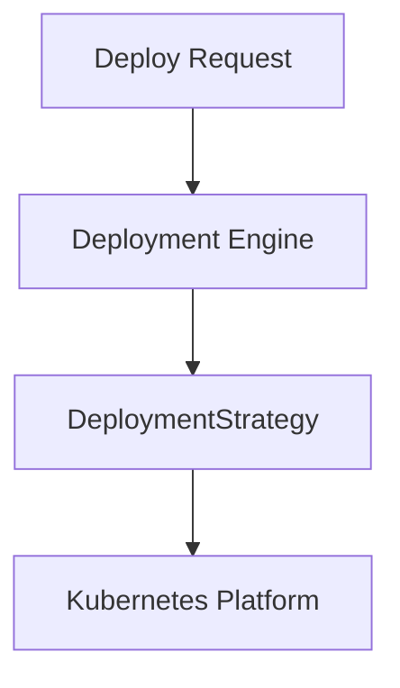
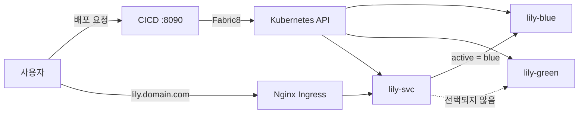
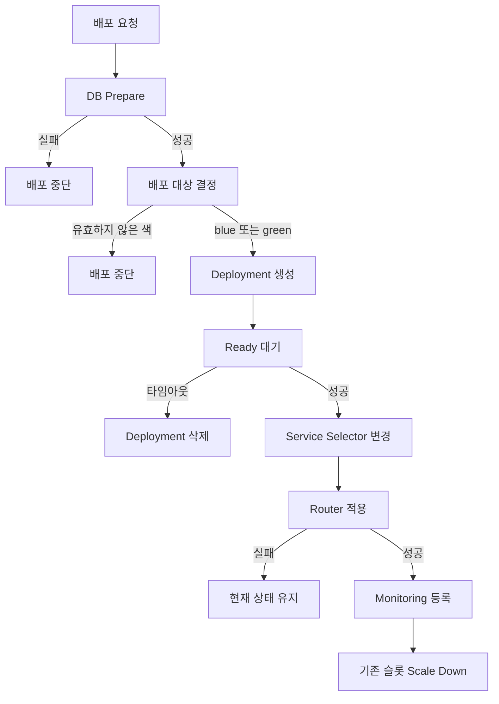
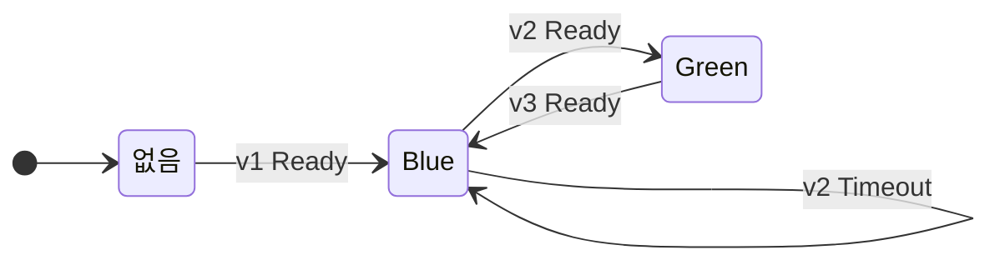

# CICD Engine Module

**Target Version:** 0.1.0

배포 요청은 Deployment Engine으로 들어오고, 엔진이 DeploymentStrategy를 거쳐 Kubernetes Platform에 반영합니다.



# 배포 전략

## 전제 사항

배포 대상 애플리케이션의 계약(Contract)은 Mock Up Repository인 `lily-blog-sample`에 정의되어 있습니다. 컨테이너 포트, Readiness/Liveness Probe, `APP_COLOR` 환경변수 등 애플리케이션이 요구하는 런타임 설정은 해당 저장소를 기준으로 합니다.

본 모듈은 애플리케이션을 직접 빌드하지 않습니다. 이미 컨테이너 레지스트리에 존재하는 이미지를 Kubernetes 클러스터에 배포하는 역할만 수행합니다.

---

## 개요

새로운 버전이 요청을 처리할 준비가 되기 전에 트래픽이 전환되면 서비스 장애가 발생할 수 있습니다. 따라서 새로운 이미지를 배포하는 동안에도 사용자는 기존 버전만 이용할 수 있어야 하며, 새 버전이 Ready 상태에 도달한 이후에만 트래픽이 전환되어야 합니다.

이를 위해 본 모듈은 Blue-Green Deployment 방식을 사용합니다. 애플리케이션마다 `blue`와 `green` 두 개의 배포 슬롯을 유지하며, 현재 트래픽을 처리하지 않는 슬롯에 새 버전을 배포합니다. 이후 해당 슬롯이 Ready 상태에 도달하면 Service Selector를 변경하여 트래픽을 한 번에 전환합니다.

### 목표

* 애플리케이션마다 `blue`와 `green` 두 개의 Deployment를 유지합니다.
* 새로운 버전은 현재 비활성 슬롯에 배포됩니다.
* 대상 슬롯이 Ready 상태에 도달하기 전에는 트래픽을 전환하지 않습니다.
* 트래픽 전환은 Service Selector 변경만으로 수행합니다.
* 배포 실패 시 기존 서비스는 계속 유지됩니다.

배포 절차 자체는 `DeploymentStrategy` 인터페이스 뒤에 있습니다. 엔진은 요청을 받아 이 인터페이스만 호출합니다. 기본값은 Blue-Green이고, `lily.deploy.strategy=canary`이면 Canary를 사용합니다. 같은 타입의 Spring Bean을 직접 등록하면 그 구현이 우선합니다.

```text
DeploymentEngine
  → DeploymentStrategy.plan
  → DeploymentStrategy.applyTarget
  → DeploymentStrategy.awaitReady
  → Canary 판정 (블루그린과 카나리, 이전 슬롯이 떠 있을 때)
  → DeploymentStrategy.switchTraffic
  → Router / Monitoring
  → DeploymentStrategy.retirePrevious
```

`BlueGreenDeploymentStrategy`의 슬롯 이름은 `blue`와 `green`입니다. `CanaryDeploymentStrategy`의 슬롯 이름은 `stable`과 `canary`입니다.

### 블루그린 전환 전 Canary 판정

새 색이 Ready가 되면 바로 전환하지 않습니다. 사용자 트래픽은 이전 색에 두고, cicd가 `{app}-canary-svc`로 30초 동안 새 색과 이전 색에 같은 요청을 보내 에러율과 p95를 비교합니다. `{app}-canary-ingress`는 만들지 않습니다. 새 Pod의 재시작과 Ready 이탈도 확인합니다. 통과하면 100%로 전환하고, 실패하면 새 Deployment를 지우고 이번 스키마 변경을 되돌립니다. 이때 응답은 `422 ROLLED_BACK`이고 트래픽은 이전 색에 그대로 있습니다. 진행 단계는 `GET /api/deployments/{app}/progress`로 봅니다. 기준과 설정은 [docs/canary-analysis.md](docs/canary-analysis.md)에 있습니다.

### Canary

`lily.deploy.strategy`를 `canary`로 두면 이 전략이 동작합니다. `lily.deploy.canary-weight-percent`는 입구 비율을 올리는 칸이고 기본값은 20이며, 허용 범위는 1 이상 50 이하입니다. 한 칸은 `lily.deploy.canary-step-seconds`(기본 30초) 동안 유지합니다.

* 첫 배포는 `stable` 슬롯에 `lily.deploy.replicas`(기본 2)개를 만들고 트래픽 전부를 그 슬롯으로 보냅니다. `canary` 슬롯은 만들지 않습니다.
* 다음 배포는 새 이미지를 쉬는 슬롯에 같은 replica 수로 올립니다. 비율을 올리기 전에 블루그린과 같은 에러율·p95 판정을 합니다. 사용자 트래픽은 이전 슬롯에 있습니다. 실패하면 새 Deployment 를 지우고 스키마를 되돌리며 `422 ROLLED_BACK` 입니다.
* 판정을 통과하면 본 Service 는 이전 슬롯만 보고, 사용자 비율은 `{app}-canary-ingress` 의 `canary-weight` 로 나눕니다. 0 에서 칸만큼 올려 100 이 됩니다.
* 100 이 되면 본 Service 의 `track` 을 새 슬롯으로 옮기고 canary Ingress 를 지웁니다. 이전 슬롯은 replica 0 으로 남겨 롤백이 되살립니다.
* Ready 전에 실패하면 그 Deployment 만 삭제하고, 이전 슬롯과 Service 는 유지합니다.
* 비율을 올리다 실패하면 canary Ingress 와 새 슬롯을 지웁니다. 사용자 트래픽은 이전 이미지에 남습니다.
* 롤백은 `POST /api/deployments/{app}/rollback` 입니다. replica 0 인 이전 슬롯을 다시 띄우고 selector 를 그 트랙으로 옮긴 뒤, 방금 슬롯을 0 으로 내립니다. 스키마 U 가 있으면 함께 되돌립니다.

`APP_COLOR`에는 슬롯 이름인 `stable` 또는 `canary`가 들어갑니다.

---

## 설계 배경

### Service Selector 기반 전환을 선택한 이유

Kubernetes의 Rolling Update는 하나의 Deployment 내부에서 기존 Pod와 신규 Pod를 동시에 운영합니다. 이 방식은 배포 과정에서 서로 다른 버전이 동시에 Service Endpoint에 포함될 수 있으며, 사용자는 전환 중 두 버전을 모두 경험할 수 있습니다.

반면 Blue-Green Deployment는 버전을 Deployment 단위로 분리합니다. Service는 `color` 레이블을 기준으로 하나의 슬롯만 선택하며, Ingress는 Service 이름만 참조합니다. 따라서 외부 진입 경로는 변경되지 않고, Service Selector만 변경하여 전체 트래픽을 즉시 전환할 수 있습니다.

이 구조에서는 트래픽 전환 이전에 반드시 Ready 상태를 검증할 수 있으며, 준비되지 않은 버전으로 요청이 전달되는 상황을 방지할 수 있습니다.

### 트래픽 흐름

사용자 트래픽과 배포 트래픽은 서로 독립적으로 동작합니다.

* 사용자는 Ingress를 통해 Service에 접근합니다.
* CICD 엔진은 Kubernetes API를 호출하여 리소스를 생성·수정합니다.
* Active 슬롯이 `blue`인 경우 사용자 요청은 `lily-blue`로만 전달됩니다.
* 배포 대상인 `green` 슬롯은 Ready 상태가 될 때까지 트래픽을 수신하지 않습니다.



---

## 배포 절차

기본 애플리케이션 이름은 `lily`입니다.

기본 전략인 Blue-Green은 현재 Service의 Selector를 기준으로 다음 배포 대상을 결정합니다.

```text
active = service.selector.color

if service 가 없거나 active 가 green 또는 비어 있음:
    target = blue
    previous = green

else if active 가 blue:
    target = green
    previous = blue

else:
    중단

database.prepare()

apply deployment(target)

wait ready(120s)

service.selector.color = target

router.route(service)

monitor.attached()

scale(previous, 0)
```

### 처리 순서



### 실패 처리 원칙

#### Ready 이전 실패

Ready 상태 확인에 실패하면 대상 Deployment를 삭제합니다.

이 시점에는 Service Selector가 변경되지 않았으므로 사용자 트래픽은 계속 기존 슬롯으로 전달됩니다.

#### Selector 변경 이후 실패

Service Selector가 변경된 이후에는 이미 사용자 트래픽이 새 슬롯으로 전달되고 있습니다.

따라서 Router 또는 Monitoring 단계에서 오류가 발생하더라도 새 슬롯은 삭제하지 않습니다. 새 슬롯을 제거하면 이미 전환된 트래픽이 즉시 중단되기 때문입니다.

---

## Active Color

Active Color는 `{appName}-svc`의 `spec.selector.color` 값으로 정의합니다.

현재 사용자 요청은 Active Color와 일치하는 Pod에만 전달됩니다.

Target Color는 이번 배포에서 새롭게 활성화할 슬롯입니다.

| Active | Target |
| ------ | ------ |
| blue   | green  |
| green  | blue   |

Service가 존재하지 않는 경우에는 첫 배포로 간주하며 `blue` 슬롯을 대상 슬롯으로 선택합니다.

이 경우 `green` 슬롯은 아직 존재하지 않으므로 Scale Down 단계는 수행되지 않습니다.

컨테이너의 `APP_COLOR` 값은 Target Color와 동일하게 설정됩니다.

`GET /version` 응답의 `color` 값이 Active Color와 일치하면 트래픽 전환이 완료된 상태입니다.

두 슬롯은 동일한 데이터베이스를 공유하며, 슬롯별로 별도의 데이터베이스를 생성하지 않습니다.

---

## DeployContext

배포 엔진은 외부 모듈과 `DeployContext`를 통해 통신합니다.

DB, Router, Logging, Monitoring 모듈은 배포 절차를 직접 알 필요 없이 `DeployContext`만 참조합니다.

| 필드            | 설명                   |
| ------------- | -------------------- |
| `appName`     | 리소스 접두사              |
| `namespace`   | Kubernetes Namespace |
| `imageUrl`    | 배포할 컨테이너 이미지         |
| `targetPort`  | 컨테이너 포트              |
| `servicePort` | Service 포트           |
| `host`        | 서비스 도메인              |
| `appVersion`  | 애플리케이션 버전            |
| `targetColor` | 배포 대상 슬롯             |
| `serviceName` | Service 이름           |
| `metricsPath` | Prometheus 수집 경로     |

동일 타입의 Spring Bean이 등록되어 있으면 해당 구현체가 사용됩니다.

구현체가 존재하지 않는 경우 기본 구현이 동작하며, 배포는 계속 진행됩니다.

---

## 스키마 마이그레이션과 롤백

배포 요청에 `migrations`(파일명 → SQL)와 `database`를 함께 보내면, 엔진이 새 슬롯을 만들기 전에 스키마를 옮깁니다. 롤백은 앱과 스키마를 함께 직전 릴리스로 되돌리고 행 데이터는 남깁니다. 규칙과 순서는 [docs/schema-migration.md](docs/schema-migration.md)에 있습니다.

```text
배포   DB 준비 → lint → dry-run → migrate → 슬롯 적용 → Ready → 트래픽 전환 → ...
                                          └ Ready 전에 실패하면 이번 버전을 U 스크립트로 되돌림
롤백   이전 슬롯 1 → Ready → selector 전환 → 백업 → U 역순 실행 → 현재 슬롯 0
```

* V 파일마다 같은 버전의 `U{버전}__*.sql`이 있어야 합니다. 되돌릴 수 없는 contract 변경은 `-- lily:irreversible`로 표시합니다.
* 이름·타입 변경, 기본값 없는 `NOT NULL` 추가는 이전 슬롯의 쿼리를 깨뜨리므로 거절합니다.
* `POST /api/deployments/{appName}/rollback`, `GET /api/deployments/{appName}`

## 모듈별 책임

### DB Module

Deployment 생성 이전에 실행됩니다.

* 환경변수 생성
* 데이터베이스 준비 작업 수행
* 실패 시 배포 중단

`APP_COLOR`, `APP_VERSION`, `SERVER_PORT`는 최종적으로 CICD 엔진이 덮어씁니다.

### CICD Engine

엔진은 배포 요청, DB 준비, Router, Monitoring을 순서대로 호출합니다. 슬롯을 고르고 트래픽을 옮기는 일은 `DeploymentStrategy`가 수행합니다.

기본 전략인 Blue-Green이 하는 일은 다음과 같습니다.

* 배포 대상 슬롯 결정
* Deployment 생성
* Ready 상태 확인
* Service Selector 변경
* 이전 슬롯 Scale Down

### Router Module

트래픽 전환 이후 실행됩니다.

기본 구현은 Nginx Ingress를 생성하며 다음 규칙을 사용합니다.

* Ingress 이름: `{appName}-ingress`
* Ingress Class: `nginx`

실패하더라도 배포는 유지됩니다.

트래픽 입구(Ingress)는 모두 `TrafficRouter` 뒤에서만 바뀝니다.

| 메서드 | 쓰는 곳 | 하는 일 |
|---|---|---|
| `route` | `DeploymentEngine` (전환 직후) | `{app}-ingress` 에 이번 host 규칙 반영 |
| `openCanary` / `closeCanary` | `CanaryDeploymentStrategy`, `CanaryAnalysis`, `DeployRecovery` | `{app}-canary-ingress` 가중치 0~100, 정리 |
| `routes` | `CanaryAnalysis` (판정 전) | 이 host 로 이미 라우팅되는지 |
| `openCanaries` | `DeployRecovery` (재시작) | canary 입구가 남은 앱 |
| `remove` | `AppRemover` | 앱의 라우트와 canary 입구 삭제 |

| 구현 | 켜지는 조건 | 동작 |
|---|---|---|
| `NginxIngressRouter` | 기본 | cicd 가 Ingress 를 직접 쓴다 |
| `HttpTrafficRouter` | `lily.router.url` (`LILY_ROUTER_URL`) 이 있을 때 | [lily-router](https://github.com/SoftBank-team-lily/lily-ingress-nginx) 에 HTTP 로 요청한다. 연결 실패·5xx 는 3번까지 다시 보낸다 |

`LILY_ROUTER_URL` 을 빼면 바로 기본 구현으로 돌아갑니다. 설정 예시는 `deploy/k3s/lily-cicd.yaml` 주석에 있습니다.

### Monitoring Module

Router 적용 이후 실행됩니다.

스크랩 대상:

```text
{serviceName}:{targetPort}{metricsPath}
```

Monitoring 등록 실패는 배포 실패로 간주하지 않습니다.

### Logging Module

배포 단계별 이벤트를 기록합니다.

```java
record(context, stage, detail)
```

Logging 실패는 배포 결과에 영향을 주지 않습니다.

---

## 상태 전이 예시



### 상태 1

최초 배포 상태입니다.

* Active 없음
* Target = blue
* Previous = green

`lily-blue`가 Ready 상태가 되면 Service Selector가 `blue`로 설정됩니다.

사용자는 `v1`만 확인할 수 있습니다.

### 상태 2

`v2` 배포 시작

* Active = blue
* Target = green

`green` 슬롯은 생성되지만 아직 트래픽을 수신하지 않습니다.

### 상태 3

Ready Timeout 발생

배포 대상 Deployment를 삭제합니다.

Service Selector는 계속 `blue`를 유지합니다.

사용자는 기존 버전을 계속 이용합니다.

### 상태 4

재배포 성공

`green` 슬롯이 Ready 상태에 도달하면 Service Selector가 `green`으로 변경됩니다.

이 시점부터 모든 신규 요청은 `v2`로 전달됩니다.

### 상태 5

Router 실패

Selector는 이미 `green`을 가리키고 있습니다.

트래픽은 정상적으로 `v2`에 도달하며 Deployment는 유지됩니다.

### 상태 6

다음 버전 배포

* Active = green
* Target = blue

기존 `blue` Deployment를 재사용하여 새 버전을 배포합니다.

Ready 상태 확인 이후 다시 `blue`로 전환됩니다.

---

## 애플리케이션 요구 사항

`lily-blog-sample`은 다음 설정을 충족해야 합니다.

| 항목                       | 값                            |
| ------------------------ | ---------------------------- |
| Container Port           | 8080                         |
| Readiness                | `/actuator/health/readiness` |
| Liveness                 | `/actuator/health/liveness`  |
| Initial Delay            | 5초                           |
| Probe Period             | 3초                           |
| APP_COLOR                | Target Color                 |
| Termination Grace Period | 30초                          |

기본 프로파일은 `prod`입니다.

PostgreSQL 연결이 존재하지 않으면 Readiness Probe가 실패합니다.

개발 환경에서는 다음 환경변수를 통해 H2를 사용할 수 있습니다.

```text
SPRING_PROFILES_ACTIVE=local
```

---

## 주요 구현 위치

| 내용                 | 위치                         |
| ------------------ | -------------------------- |
| 배포 엔진              | `DeploymentEngine`         |
| 배포 전략 인터페이스        | `DeploymentStrategy`       |
| Blue-Green 구현       | `BlueGreenDeploymentStrategy` |
| Canary 구현           | `CanaryDeploymentStrategy` |
| 확장 모듈 인터페이스        | `com.lily.cicd.module`     |
| 배포 API             | `POST /api/deployments`    |
| 롤백 엔진              | `RollbackEngine`, `POST /api/deployments/{appName}/rollback` |
| 스키마 마이그레이션         | `com.lily.cicd.schema` (`SchemaMigrator`, `MigrationLinter`) |
| 릴리스 기록, 배포 잠금      | `com.lily.cicd.release` (`ReleaseStore`, `DeployLock`) |
| 결과 DTO             | `DeploymentResultDto`      |
| 배포 테스트             | `K8sBlueGreenDeployerTest`, `CanaryDeploymentStrategyTest`, `DeployWithMigrationTest`, `RollbackEngineTest` |
| 스키마 테스트            | `SchemaMigratorPostgresTest`, `SchemaMigratorMysqlTest` (Testcontainers, Docker 필요) |
| 커버리지 검사            | `./gradlew check` 가 라인 커버리지 75% 초과를 요구합니다 |
